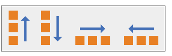
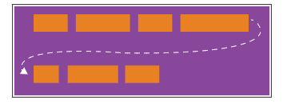
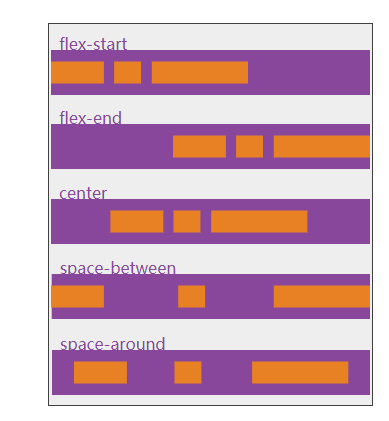

[TOC]

此文档参考以下资料

- [一个完整的Flexbox指南](https://www.w3cplus.com/css3/a-guide-to-flexbox-new.html)

# 概念介绍

- Flex布局背后的主要思想是给容器控制项目（Flex项目）的宽度、高度的能力，使用Flex项目可以自动填满容器的可用空间（主要是适应所有类型的显示设备和屏幕大小）。
- Flex容器使用Flex项目可以自动放大与收缩，用来填补可用的空闲空间。

>  **注**：Flexbox布局比较适合Web应用程序的一些小组件和小规模的布局，而Grid布局更适合用于一些大规模的布局。

# 基础知识和专业术语

- Flexbox是一个**模块**，涉及很多东西。其中有一些是容器上的属性（父元素，也被称为“flex容器”），而有一些是容器子元素上的属性（常称为“flex项目”）。

- Flex**布局**就是基于“**Flex-flow**”方向

  

  - 基本上，Flex项目是沿着`main axis`(从`main-start`向`main-end`)或者`cross axis`(从`cross-start`向`cross-end`)排列。
  - **main axis:**Flex容器的主轴主要用来配置Flex项目。注意，它不一定是水平，这主要取决于`flex-direction`属性。
  - **main-start | main-end:**Flex项目的配置从容器的主轴起点边开始，往主轴终点边结束。
  - **main size:**Flex项目的在主轴方向的宽度或高度就是项目的主轴长度，Flex项目的主轴长度属性是`width`或`height`属性，由哪一个对着主轴方向决定。
  - ** cross axis:**与主轴垂直的轴称作侧轴，是侧轴方向的延伸。
  - **cross-start | cross-end:**伸缩行的配置从容器的侧轴起点边开始，往侧轴终点边结束。
  - **cross size:**Flex项目的在侧轴方向的宽度或高度就是项目的侧轴长度，Flex项目的侧轴长度属性是`width`或`height`属性，由哪一个对着侧轴方向决定。

# Flex容器属性

##  display

```css
.container {
    display: flex; /*or inline-flex*/
}
```

> 1. Flex容器不是块容器，因此有些设计用来控制块布局的属片在Flexbox布局中不适用。特别是：多列组中所有`column-*`属性、`float`、`clear`属性和`vertical-align`属性在Flex容器上没有作用。
> 2. 如果元素`display`的值指定为`inline-flex`，而且元素是一个浮动元素或绝对定位元素，则`display`的计算值是`flex`。

## flex-direction



- 用来创建方轴，从而定义Flex项目在Flex容器中放置的方向。

- 声明方式

  ```css
  .container {
      flex-direction: row; /* row | row-reverse | column | column-reverse */
  }
  ```

- 参数解释

  - **row(默认值):**正向排列
  - **row-reverse:**反向排列
  - **column:**和`row`类似，只不过方向是从上到下排列
  - **column-reverse:**和`row-reverse`类似，只不过方向是从下向上排列

## flex-wrap



- 默认情况之下，Flex项目都尽可能在一行显示。

- 根据`flex-wrap`的属性值来改变，让Flex项目多行显示，决定新的一行堆放方向。

- 声明方式

  ```css
  .container {
      flex-wrap: nowrap; /* nowrap | wrap | wrap-reverse*/
  }
  ```

- 参数解释

  - **nowrap(默认值):**单行显示，正向排列
  - **wrap:**多行显示，正向排列
  - **wrap-reverse:**多行显示，反向排列

## flex-flow(适用于flex容器元素)

- `flex-direction`和`flex-wrap`两个属性的缩写。

- 决定了伸缩容器的主轴与侧轴。

- 默认值是`row nowrap`（中间用空格隔开）。

- 声明方式

  ```css 
  flex-flow: <‘flex-direction’> || <‘flex-wrap’>
  ```

## justify-content



- 用于在主轴上对齐伸缩项目。
- 在所有可伸缩长度及所有自动边距均被解释后进行。
- 当一行上的所有伸缩项目都不能伸缩或可伸缩但是已经达到其最大长度时，这一属性才会对多余的空间进行分配。当项目溢出某一行时，这一属性也会在项目的对齐上施加一些控制。