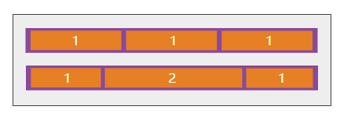

[TOC]

此文档参考以下资料

- [一个完整的Flexbox指南](https://www.w3cplus.com/css3/a-guide-to-flexbox-new.html)

# 概念介绍

- Flex布局背后的主要思想是给容器控制项目（Flex项目）的宽度、高度的能力，使用Flex项目可以自动填满容器的可用空间（主要是适应所有类型的显示设备和屏幕大小）。
- Flex容器使用Flex项目可以自动放大与收缩，用来填补可用的空闲空间。

>  **注**：Flexbox布局比较适合Web应用程序的一些小组件和小规模的布局，而Grid布局更适合用于一些大规模的布局。

# 基础知识和专业术语

- Flexbox是一个**模块**，涉及很多东西。其中有一些是容器上的属性（父元素，也被称为“flex容器”），而有一些是容器子元素上的属性（常称为“flex项目”）。

- Flex**布局**就是基于“**Flex-flow**”方向

  

  - 基本上，Flex项目是沿着`main axis`(从`main-start`向`main-end`)或者`cross axis`(从`cross-start`向`cross-end`)排列。
  - **main axis:**Flex容器的主轴主要用来配置Flex项目。注意，它不一定是水平，这主要取决于`flex-direction`属性。
  - **main-start | main-end:**Flex项目的配置从容器的主轴起点边开始，往主轴终点边结束。
  - **main size:**Flex项目的在主轴方向的宽度或高度就是项目的主轴长度，Flex项目的主轴长度属性是`width`或`height`属性，由哪一个对着主轴方向决定。
  - ** cross axis:**与主轴垂直的轴称作侧轴，是侧轴方向的延伸。
  - **cross-start | cross-end:**伸缩行的配置从容器的侧轴起点边开始，往侧轴终点边结束。
  - **cross size:**Flex项目的在侧轴方向的宽度或高度就是项目的侧轴长度，Flex项目的侧轴长度属性是`width`或`height`属性，由哪一个对着侧轴方向决定。

# Flex容器属性


##  display

```css
.container {
    display: flex; /*or inline-flex*/
}
```

> 1. Flex容器不是块容器，因此有些设计用来控制块布局的属片在Flexbox布局中不适用。特别是：多列组中所有`column-*`属性、`float`、`clear`属性和`vertical-align`属性在Flex容器上没有作用。
> 2. 如果元素`display`的值指定为`inline-flex`，而且元素是一个浮动元素或绝对定位元素，则`display`的计算值是`flex`。

## flex-direction


- 用来创建方轴，从而定义Flex项目在Flex容器中放置的方向。

- 声明方式

  ```css
  .container {
      flex-direction: row; /* row | row-reverse | column | column-reverse */
  }
  ```

- 参数解释

  - **row(默认值):**正向排列
  - **row-reverse:**反向排列
  - **column:**和`row`类似，只不过方向是从上到下排列
  - **column-reverse:**和`row-reverse`类似，只不过方向是从下向上排列

## flex-wrap


- 默认情况之下，Flex项目都尽可能在一行显示。

- 根据`flex-wrap`的属性值来改变，让Flex项目多行显示，决定新的一行堆放方向。

- 声明方式

  ```css
  .container {
      flex-wrap: nowrap; /* nowrap | wrap | wrap-reverse*/
  }
  ```

- 参数解释

  - **nowrap(默认值):**单行显示，正向排列
  - **wrap:**多行显示，正向排列
  - **wrap-reverse:**多行显示，反向排列

## flex-flow(适用于flex容器元素)

- `flex-direction`和`flex-wrap`两个属性的缩写。

- 决定了伸缩容器的主轴与侧轴。

- 默认值是`row nowrap`（中间用空格隔开）。

- 声明方式

  ```css 
  flex-flow: <‘flex-direction’> || <‘flex-wrap’>
  ```

## justify-content


- 用于在主轴上对齐伸缩项目。
- 在所有可伸缩长度及所有自动边距均被解释后进行。
- 当一行上的所有伸缩项目都不能伸缩或可伸缩但是已经达到其最大长度时，这一属性才会对多余的空间进行分配。当项目溢出某一行时，这一属性也会在项目的对齐上施加一些控制。
- 声明方式

```css
.container {
	justify-content: flex-start; 
  	/* flex-start | flex-end | center | space-between | space-around */
}
```

- 参数解释
  - **flex-start(默认值)**:伸缩项目**向一行的起始位置靠齐**。该行的第一个伸缩项目在主轴起点边的外边距与该行在主轴起点的边对齐，同时所有后续的伸缩项目与其前一个项目对齐。
  - **flex-end**:伸缩项目**向一行的结束位置靠齐**。该行的最后一个伸缩项目在主轴终点边的外边距与该行在主轴终点的边对齐，同时所有前面的伸缩项目与其后一个项目对齐。
  - **center**:伸缩项目**向一行的中间位置靠齐**。该行的伸缩项目将相互对齐并在行中居中对齐，同时第一个项目与该行在主轴起点的边的距离等同与最后一个项目与该行在主轴终点的边的距离（如果剩余空间是负数，则保持两端溢出的长度相等）。
  - **space-between**:伸缩项目会**平均地分布在行里**。
    - 如果*剩余空间是负数，或该行只有一个伸缩项目*，则此值等效于flex-start。
    - 在其它情况下，第一个项目在主轴起点边的外边距会与该行在主轴起点的边对齐，同时最后一个项目在主轴终点边的外边距与该行在主轴终点的边对齐，而剩下的伸缩项目在确保两两之间的空白空间相等下平均分布。
  - **space-around:** 伸缩项目会**平均地分布在行里，两端保留一半的空间**。
    - 如果剩余空间是负数，或该行只有一个伸缩项目，则该值等效于center。
    - 在其它情况下，伸缩项目在确保两两之间的空白空间相等，同时第一个元素前的空间以及最后一个元素后的空间为其他空白空间的一半下平均分布。

## align-items


- 在伸缩容器的当前行的**侧轴**上进行对齐

- `align-items`可以用来设置伸缩容器中**包括匿名伸缩项目的所有项目**的对齐方式。

- 声明方式

  ```css
  .container {
      align-items: flex-start;
    	/* flex-start | flex-end | center | baseline | stretch */
  }
  ```

- 参数解释

  - **flex-start:**伸缩项目在侧轴起点边的外边距紧靠住该行在**侧轴起始的边**。
  - **flex-end:**伸缩项目在侧轴终点边的外边距靠住该行在**侧轴终点的边** 。
  - **center:**伸缩项目的外边距盒在该行的**侧轴上居中放置**。（如果伸缩行的尺寸小于伸缩项目，则伸缩项目会向两个方向溢出相同的量）。
  - **baseline**
    - 如果伸缩项目的行内轴与侧轴为同一条，则该值和`flex-start`等效。
    - 其它情况下，该值将参与基线对齐。所有参与该对齐方式的伸缩项目将按下列方式排列：首先将这些伸缩项目的基线进行对齐，随后其中基线至侧轴起点边的外边距距离最长的那个项目将紧靠住该行在侧轴起点的边。
  - **stretch:**如果侧轴长度属性的值为`auto`，则此值会使项目的外边距盒的尺寸在遵照`min/max-width/height`属性的限制下尽可能接近所在行的尺寸


#  Flex项目属性

## order


- 控制Flex项目的顺序源

- 声明方式

  ```css
  .item{
      order: <integer>;
  }
  ```

> 根据`order`重新排序伸缩项目。有最小（负值最大）`order`的伸缩项目排在第一个。
>
> 若有多个项目有相同的`order`值，这些项目照**文件顺序**排

## flex-grow



- 它接受一个没有单位的值作为一个比例（不能为负值）


- 可以定义一个Flex项目的扩大比例

  - 如果所有Flex项目的`flex-grow`设置为`1`时，表示Flex容器中的Flex项目具有相等的尺寸。
  - 如果你给其中一个Flex项目设置`flex-grow`的值为`2`，那么这个Flex项目的尺寸将是其他Flex项目两倍（其他Flex项目的`flex-grow`值为`1`）。

- 声明方式

  ```css
  .item {
      flex-grow: <number>; /* default: 0 */
  }
  ```

## flex-shrink

- 定义Flex项目的**缩小**比例（不能为负值）

- 声明方式

  ```css
  .item {
      flex-shrink: <number>; /* default: 1 */
  }
  ```

## flex-basis

- 定义了Flex项目在分配Flex容器剩余空间之前的一个默认尺寸。

- `main-size`值使它具有匹配的宽度或高度，不过都需要取决于`flex-direction`的值。

- 声明方式

  ```css
  flex-basis: <length> | auto; /* default: auto */
  ```

- 如果设置为`0`，内容不在考虑周围额外空间。如果设置为`auto`，额外空间会基于`flex-grow`值做分布。如下图所示：

  

## flex

- `flex`是`flex-grow`，`flex-shrink`和`flex-basis`三个属性的缩写。第二个和第三个参数(`flex-shrink`和`flex-basis`)是可选值。其默认值是`0 1 auto`。

- 声明方式

  ```css
  .item {
    flex: none | [ <'flex-grow'> | <'flex-shrink'> ? || <'flex-basis'> ];
  }
  ```

> 建议使用此简写属性，而不是设置单独属性。
>
> **注意**，如果`flex`取值为`none`时，其相当于取值为`0 0 auto`。

## flex常见值

- **`flex: 0 auto`,`flex: initial`**与`flex: 0 1 auto`相同。
  - 根据`width`／`height`属性决定元素的尺寸。（如果项目的主轴长度属性的计算值为`auto`，则会根据其内容来决定元素尺寸。）
  - 当剩余空间为正值时，伸缩项目无法伸缩
  - 当空间不足时，伸缩项目可收缩至其最小值。
- **`flex: auto`**与`flex: 1 1 auto`相同。
  - 根据`width`／`height`属性决定元素的尺寸，但是**完全可以伸缩**，会吸收主轴上剩下的空间。
  - 如果所有项目均为`flex: auto`、`flex: initial`或`flex: none`，则在项目尺寸决定后，剩余的正空间会被平分给是`flex: auto`的项目。
- **`flex: none`**与`flex: 0 0 auto`相同。
  - 根据`width`／`height`属性决定元素的尺寸，但是**完全不可伸缩**。
  - 其效果与`initial`类似，但*即使在空间不够而溢出的情况下，伸缩项目也不能收缩。*
- **`flex: <positive-number>`**与`flex: 1 0px`相同。
  - 该值使元素*可伸缩，并将伸缩基准值设置为零，导致该项目会根据设置的比率占用伸缩容器的剩余空间*。如果一个伸缩容器里的所有项目都使用此模式，则它们的尺寸会正比于指定的伸缩比率。
- **默认状态下**，伸缩项目不会收缩至比其最小内容尺寸（最长的英文词或是固定尺寸元素的长度）更小。网页作者可以靠设置`min-width`或`min-height`属性来改变这个默认状态。

## align-self

 

- 用来在单独的伸缩项目上覆写默认的对齐方式。

- 声明方式

  ```css
  .item {
      align-self: auto | flex-start | flex-end | center | baseline | stretch
  }
  ```

- 若伸缩项目的任一个侧轴上的外边距为`auto`，则`align-self`没有效果。

- 如果`align-self`的值为`auto`，则其计算值为元素的父元素的`align-items`值，如果该元素没有父元素，则计算值为`stretch`。

- 对齐属性值的定义如下：

  - **flex-start:**伸缩项目在侧轴起点边的外边距紧靠住该行在侧轴起始的边。
  - **flex-end:**伸缩项目在侧轴终点边的外边距靠住该行在侧轴终点的边 。
  - **center:**伸缩项目的外边距盒在该行的侧轴上居中放置。（如果伸缩行的尺寸小于伸缩项目，则伸缩项目会向两个方向溢出相同的量）。
  - **baseline:**如果伸缩项目的行内轴与侧轴为同一条，则该值和`flex-start`等效。其它情况下，该值将参与基线对齐。所有参与该对齐方式的伸缩项目将按下列方式排列：首先将这些伸缩项目的基线进行对齐，随后其中基线至侧轴起点边的外边距距离最长的那个项目将紧靠住该行在侧轴起点的边。
  - **stretch:**如果侧轴长度属性的值为`auto`，则此值会使项目的外边距盒的尺寸在遵照`min/max-width/height`属性的限制下尽可能接近所在行的尺寸。

  > 注意：如果伸缩伸缩的高度有限制，此可能导致伸缩项目的内容溢出该项目。

  ​